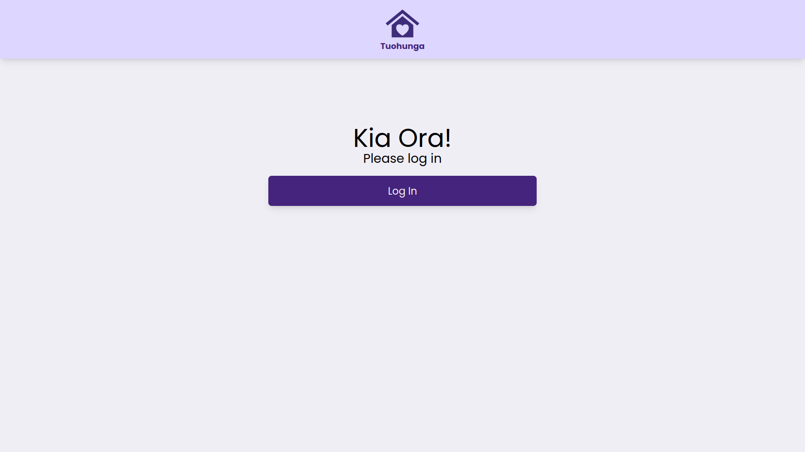

# Women's Refuge - Safe House Website

This website is designed to be used by safe house hosts, members of the police, and Women's Refuge employees. Its purpose is to speed up the process of moving domestic violence victims into safe houses throughout New Zealand.

## MVP
1. Landing page with login. (For safe house administrators (hosts), police (user accounts), and the master administrator.
1. Hosts should be able to view vacancies in all houses across NZ, the city that these safe houses are in, and contact details for the safe houses.
1. The hosts are able to update/edit their data only i.e. general comments (e.g. about house pets), number of rooms, number of beds, etc.
1. The police have read-only access: safe house phone numbers, vacancies, and general locations.
1. The master admin has control over the safe house database regarding the addition/removal of any new safe houses.
1. The master admin approves the user accounts (the police and hosts).
1. All data is anonymous (and fictional). The vacancy data is purely an integer regarding the number of beds available for women to stay in. For example, 'there are 8 vacancies available'.

## User Stories

As a user, I want to open the app and be able to login as either: a master admin, a host admin, or a user (police officer).

### Police User Stories

1. After logging in, I want to be sent to the homepage where I then have the options to either: select the North Island, select the South Island, view all vacancies, or conduct a specific search.
1. When clicking on the North Island button, I want to be sent to a page which lists all of the regions which are available to select from. A 'view all in North Island' button should be in the page's footer (and the equivalent for the South Island).
1. When clicking on a region, I want to be redirected to a page which lists all of the safe houses in that region, and their respective vacancies.
1. When I click on a safe house, I want to be redirected to a page with all of the information about the house, including additional comments (for example, information about any pets in the house).
1. When clicking on the view all button on the landing page, I want to be guided to a page where all vacancies in New Zealand are displayed.
1. When clicking on the search button, I want to be guided to an 'advanced search' page where I can specify the locations I want to see.

Diagram:
https://dbdiagram.io/d/60926e79b29a09603d1377d6
<<<<<<< HEAD

### Sreen Shots
Login page

||||||| 3e224e0
=======

### Screenshots
Login

Homepage

View all regions

Search

House page(general user)

House page(admin user)

Add house(admin only)

Edit house(admin only)
![Edit house]
>>>>>>> ae3c905d75d650dcc9d160ee7f2443586cb92e12
